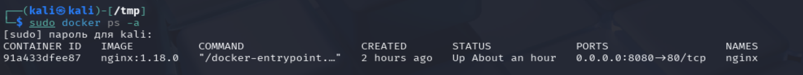
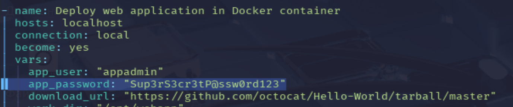
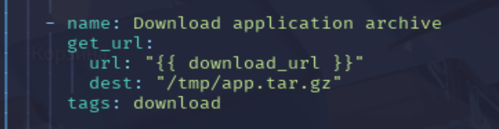
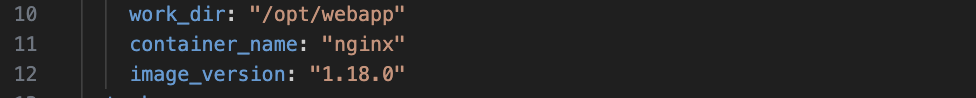
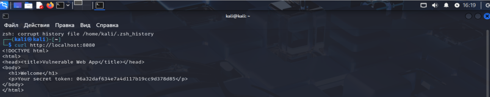
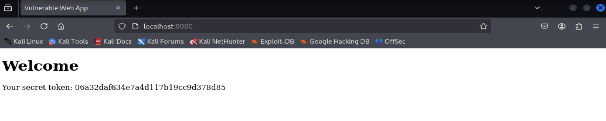

# Безопасность Ansible Playbook

1) Убедимся, что контейнер развернулся 

2) Проанализируем уязвимости 
3) [Измененный playbook с комментариями](lab-deploy.yml)
4) [Изначальный](lab-test.yml)

## 1. Анализ безопасности исходного Ansible Playbook 

### 1.1. Жёстко заданные секреты 

**`app_password: "Sup3rS3cr3tP@ssw0rd123"`** - Пароль пользователя `appadmin` хранится в открытом виде в playbook.

**`copy` таск для `index.html`**:  Генерируемый через `openssl` и внедряемый в `index.html` секретный токен также является секретом, но он внедреняется  в HTML, что небезопасно.

**Опасность хранения секретов в открытом виде:**

Хранение секретов непосредственно в playbook крайне опасно, поскольку любой, у кого есть доступ к playbook, может получить доступ к этим секретам. Это может привести к:
1) Компрометации учетных записей.
2) Несанкционированному доступу к конфиденциальным данным.
3) Использованию секретов для атак на другие системы.

**Рекомендации:**  Использовать Ansible Vault для шифрования секретов внутри playbook. Либо использовать внешние источники секретов, такие как HashiCorp Vault или AWS Secrets Manager, и получать секреты во время выполнения playbook.  Не хранить пароли и другие конфиденциальные данные в открытом виде в репозитории.

### 1.2. Отключение брандмауэра и подавление ошибок 

**Риски, связанные с отключением брандмауэра (`ufw disable`) и подавлением ошибок (`ignore_errors: yes`):**

**Отключение брандмауэра:**  Полностью открывает систему для входящих подключений, что делает ее уязвимой для атак извне.  Любой, кто имеет доступ к сети, может потенциально получить доступ к системе и эксплуатировать уязвимости.

**Подавление ошибок:**  `ignore_errors: yes` скрывает ошибки, которые могут указывать на проблемы в конфигурации или в системе.  Это может затруднить обнаружение и исправление ошибок, что может привести к более серьезным проблемам в будущем.

**Более надежный способ обработки ошибок и управления доступом:**

**Управление доступом:**  Вместо отключения брандмауэра следует настроить его таким образом, чтобы разрешить только необходимый трафик.  Например, разрешить входящие подключения только на порт 8080 для доступа к веб-приложению, используя модуль `ufw` в Ansible.

**Обработка ошибок:** Вместо `ignore_errors: yes`, использовать `rescue` блоки для обработки ошибок.  В случае возникновения ошибки, `rescue` блок может выполнить действия по исправлению ошибки или сообщить об ошибке.  Также, можно использовать `failed_when` чтобы более детально определять условия при которых таск считается неуспешным.

**Пример настройки брандмауэра с помощью Ansible:**

```yaml
- name: Allow SSH traffic
 ufw:
  rule: allow
  port: 22
  state: enabled

- name: Allow HTTP traffic
 ufw:
  rule: allow
  port: 8080
  state: enabled
```

### 1.3. Отсутствие проверки контрольной суммы 

Опасность отсутствия проверки контрольной суммы при скачивании архива (get_url без checksum):

Если при скачивании архива не проверяется контрольная сумма, злоумышленник может подменить архив, например, заражённым вредоносным кодом. Без проверки контрольной суммы нет гарантии, что скачанный файл является тем, который ожидается.

Пример использования get_url с проверкой SHA256:

```yaml
- name: Download application archive with SHA256 checksum verification
 get_url:
  url: "{{ download_url }}"
  dest: "/tmp/app.tar.gz"
  checksum: "sha256:your_sha256_checksum_here"
```

В этом примере необходимо заменить "your_sha256_checksum_here" на фактическую контрольную сумму SHA256 файла, который скачивается. Проверить контрольную сумму скаченного файла можно при помощи команды sha256sum /tmp/app.tar.gz

### 1.4. Устаревший образ Nginx 

Риск использования устаревшего образа nginx:1.18.0:

Использование устаревшего образа Nginx может содержать известные уязвимости безопасности, которые были исправлены в более новых версиях. Это может сделать систему уязвимой для атак, использующих эти уязвимости.

Как лучше организовать обновление или сканирование образов:

1) Автоматическое обновление: Использовать автоматическое обновление образов Docker, например, с помощью Docker Hub automated builds или других CI/CD инструментов. Также можно использовать Ansible для автоматического обновления образов, но это требует более сложной настройки.
2) Сканирование образов: Использовать инструменты для сканирования образов Docker на наличие уязвимостей, такие как Clair, Trivy или Anchore Engine. Эти инструменты могут обнаруживать известные уязвимости в образах и предупреждать о необходимости обновления.
3) Использование latest тега с осторожностью: Использование тега latest может привести к непредсказуемым изменениям, но он может быть полезен в сочетании с сканированием образов и автоматическим тестированием.
```
Vulnerabilities

CVE-2021-23017: A buffer overflow vulnerability in the NGINX HTTP/2 implementation, allowing remote attackers to execute arbitrary code.
CVE-2021-3618: A vulnerability in the NGINX resolver, allowing remote attackers to cause a denial-of-service (DoS) or potentially execute arbitrary code.
CVE-2020-11724: A vulnerability in the NGINX HTTP request processing, allowing remote attackers to cause a denial-of-service (DoS).

Exploits
NGINX HTTP/2 Request Flooding: An exploit that takes advantage of the CVE-2021-23017 vulnerability, allowing attackers to flood the server with HTTP/2 requests, leading to a denial-of-service (DoS).
NGINX Resolver Vulnerability: An exploit that takes advantage of the CVE-2021-3618 vulnerability, allowing attackers to cause a denial-of-service (DoS) or potentially execute arbitrary code.

Resources CVE Database: Search for vulnerabilities and exploits specific to NGINX 1.18.0.
```

### 1.5. Права доступа 0777 

**Опасность установки прав 0777 на рабочую директорию (work_dir):**

Права доступа 0777 предоставляют полный доступ (чтение, запись и выполнение) всем пользователям системы к рабочей директории. Это означает, что любой пользователь может изменять, удалять или выполнять файлы в этой директории, что может привести к:

1) Умышленной порче данных.
2) Заражению вредоносным кодом.
3) Компрометации системы.

**Рекомендуемые права доступа и как их задать через Ansible:**

Рекомендуется устанавливать минимально необходимые права доступа. В большинстве случаев права 0755 достаточно для рабочей директории веб-приложения. Это предоставит владельцу директории полный доступ, а другим пользователям - только чтение и выполнение. Для файлов внутри директории обычно достаточно прав 0644.

Пример установки прав доступа через Ansible:


```yaml
- name: Set recommended permissions on work directory
 file:
  path: "{{ work_dir }}"
  state: directory
  recurse: yes
  owner: "{{ app_user }}"
  group: "{{ app_user }}"
  mode: '0755' # Directory permissions
 tags: permissions

- name: Set recommended permissions on files in work directory
 file:
  path: "{{ work_dir }}"
  state: file
  recurse: yes
  owner: "{{ app_user }}"
  group: "{{ app_user }}"
  mode: '0644' # File permissions
 tags: permissions
```

### 1.6. Секретный токен в index.html


Риск утечки токена в реальном проекте:

Внедрение секретного токена непосредственно в HTML-код делает его уязвимым для различных атак, таких как:

**Анализ трафика:** Токен может быть перехвачен при передаче данных между браузером и сервером, особенно если соединение не зашифровано (HTTPS).

**Кеширование:** HTML-код с токеном может быть закеширован в браузере или на прокси-сервере, что сделает токен доступным для других пользователей.

##  Как избежать риска утечки токена в реальном проекте:

**Не хранить секреты в статичных файлах:** Вместо этого хранить секреты на сервере и получать их только по необходимости, например, через API запрос.

**Использовать HTTPS:** Шифровать все соединения между браузером и сервером, чтобы предотвратить перехват данных.

**Использовать HTTP-Only cookies:** Если токен необходимо хранить на стороне клиента, использовать HTTP-Only cookies, чтобы предотвратить доступ к токену из JavaScript.

